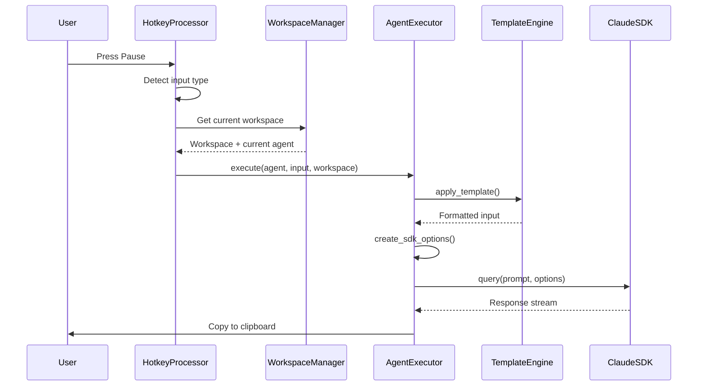
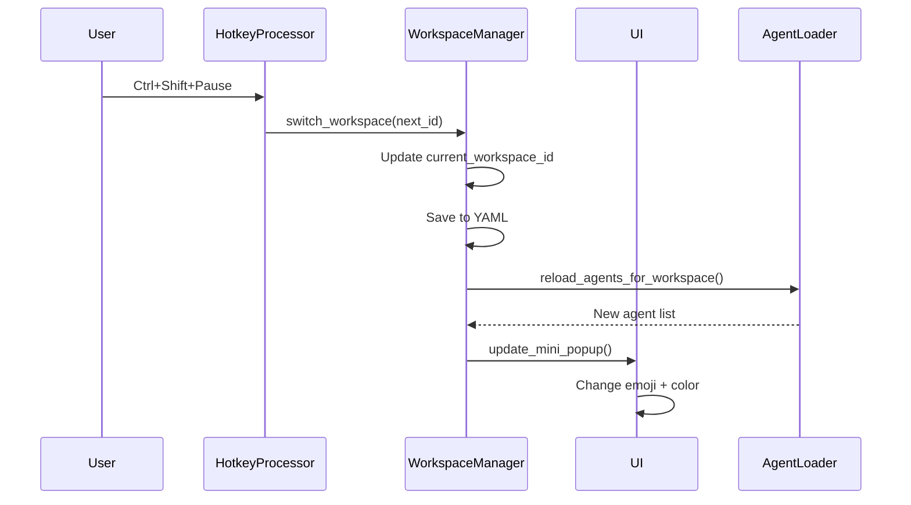
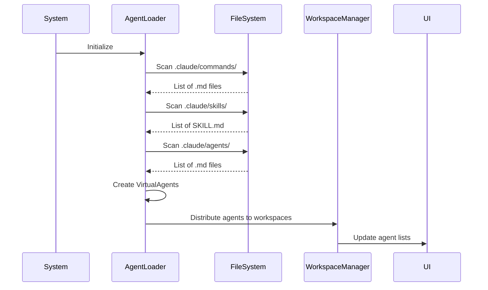

# AgentClick V2 - Documentação Técnica

**Versão:** 2.0
**Data:** 2025-12-29
**Status:** Especificação Técnica para Implementação
**Autores:** Claude Code Technical Architect

---

## Sumário Executivo

Este documento detalha a especificação técnica completa do AgentClick V2, incluindo arquitetura, componentes, padrões de design, APIs, e estratégias de migração da V1 para V2. A mudança fundamental é a transição de um sistema com 3 agents hardcoded em Python para uma plataforma extensível que utiliza a estrutura nativa do ecossistema Claude (`.claude/`).

### Principais Mudanças Técnicas

| Aspecto | V1 | V2 | Impacto Técnico |
|---------|----|----|-----------------|
| **Agents** | Classes Python hardcoded | Arquivos `.md` dinâmicos | Sistema de descoberta automática |
| **Contexto** | Global (único) | Workspaces isolados | Multi-context management |
| **System Prompt** | Strings em código | Conteúdo de `.md` | Template engine + file loader |
| **Configuração** | JSON por agent | YAML por workspace | Nova estrutura de config |
| **UI** | 2 abas | 3 abas (+Workspaces) | Novos componentes PyQt6 |
| **SDK Integration** | Direto, hardcoded | Factory pattern dinâmico | Virtual agent executor |

---

## 1. Arquitetura do Sistema

### 1.1. Visão Geral em Camadas

```
┌─────────────────────────────────────────────────────────────┐
│                     CAMADA DE APRESENTAÇÃO                   │
│  ┌──────────────┐  ┌──────────────┐  ┌──────────────┐      │
│  │ Mini Popup   │  │Detailed Popup│  │ Hotkey       │      │
│  │ (PyQt6)      │  │  (PyQt6)     │  │Processor     │      │
│  └──────────────┘  └──────────────┘  └──────────────┘      │
└─────────────────────────────────────────────────────────────┘
                              ↓
┌─────────────────────────────────────────────────────────────┐
│                     CAMADA DE DOMÍNIO                        │
│  ┌──────────────┐  ┌──────────────┐  ┌──────────────┐      │
│  │Workspace     │  │Agent         │  │Input         │      │
│  │Manager       │  │Registry      │  │Processor     │      │
│  └──────────────┘  └──────────────┘  └──────────────┘      │
│  ┌──────────────┐  ┌──────────────┐                       │
│  │Template      │  │Virtual Agent │                       │
│  │Engine        │  │Executor      │                       │
│  └──────────────┘  └──────────────┘                       │
└─────────────────────────────────────────────────────────────┘
                              ↓
┌─────────────────────────────────────────────────────────────┐
│                   CAMADA DE INTEGRAÇÃO SDK                   │
│  ┌──────────────┐  ┌──────────────┐  ┌──────────────┐      │
│  │Claude SDK    │  │MCP Servers   │  │Claude        │      │
│  │Client        │  │Integration   │  │Agent Options │      │
│  └──────────────┘  └──────────────┘  └──────────────┘      │
└─────────────────────────────────────────────────────────────┘
                              ↓
┌─────────────────────────────────────────────────────────────┐
│                     CAMADA DE PERSISTÊNCIA                   │
│  ┌──────────────┐  ┌──────────────┐  ┌──────────────┐      │
│  │workspaces.   │  │input_        │  │.claude/      │      │
│  │yaml          │  │templates.yaml│  │structure     │      │
│  └──────────────┘  └──────────────┘  └──────────────┘      │
└─────────────────────────────────────────────────────────────┘
```

### 1.2. Componentes Principais

#### A. Workspace Manager (NOVO)
```python
class WorkspaceManager:
    """
    Gerencia múltiplos contextos de trabalho isolados.
    Central para arquitetura V2.
    """
    _workspaces: dict[str, Workspace]
    _current_workspace_id: str
    _config_path: Path

    # Core operations
    def load_workspaces() -> None
    def switch_workspace(workspace_id: str) -> None
    def get_current_workspace() -> Workspace
    def get_workspace_agents(workspace_id: str) -> list[VirtualAgent]
    def add_workspace(config: WorkspaceConfig) -> None
    def remove_workspace(workspace_id: str) -> None
```

#### B. Dynamic Agent Loader (NOVO)
```python
class DynamicAgentLoader:
    """
    Scan automático de .claude/ estrutura e cria agentes virtuais.
    Substitui o sistema de classes hardcoded da V1.
    """
    _commands_dir: Path
    _skills_dir: Path
    _agents_dir: Path

    # Scanning methods
    def scan_all() -> list[VirtualAgent]
    def scan_commands() -> list[VirtualAgent]
    def scan_skills() -> list[VirtualAgent]
    def scan_custom_agents() -> list[VirtualAgent]

    # Virtual agent creation
    def create_virtual_agent(source_file: Path, type: AgentType) -> VirtualAgent
    def extract_metadata(md_file: Path) -> AgentMetadata
```

#### C. Virtual Agent Executor (NOVO)
```python
class VirtualAgentExecutor:
    """
    Executa agentes virtuais usando Claude SDK.
    Factory pattern para criar ClaudeAgentOptions dinâmico.
    """
    _template_engine: TemplateEngine

    # Execution
    async def execute(
        agent: VirtualAgent,
        input_text: str,
        workspace: Workspace
    ) -> str

    # SDK options factory
    def create_sdk_options(
        agent: VirtualAgent,
        workspace: Workspace,
        input_text: str
    ) -> ClaudeAgentOptions

    # MCP integration
    def create_mcp_server(agent: VirtualAgent) -> McpSdkServerConfig | None
```

#### D. Input Template Engine (NOVO)
```python
class TemplateEngine:
    """
    Processa templates de input com variáveis.
    Substitui strings estáticas da V1.
    """
    _templates: dict[str, TemplateConfig]

    # Template operations
    def apply_template(
        template: str,
        variables: dict[str, Any]
    ) -> str
    def parse_variables(template: str) -> list[str]
    def validate_template(template: str) -> bool
```

#### E. Multi-Input Processor (MELHORADO)
```python
class InputProcessor:
    """
    Detecta e processa múltiplos tipos de input.
    Expandido na V2 para suportar mais tipos.
    """
    # Input types
    INPUT_TYPE_TEXT = "text"           # V1
    INPUT_TYPE_FILE = "file"           # V1
    INPUT_TYPE_EMPTY = "empty"         # V1
    INPUT_TYPE_MULTIPLE = "multiple"   # V1 (melhorado)
    INPUT_TYPE_URL = "url"             # NOVO V2

    # Processing
    async def detect_input_type() -> InputType
    async def process_text(text: str) -> str
    async def process_file(file_path: Path) -> str
    async def process_multiple(files: list[Path]) -> list[str]
    async def process_url(url: str) -> str
    async def process_empty() -> str
```

---

## 2. Estrutura de Dados

### 2.1. Virtual Agent (NOVO CONCEITO)

```python
@dataclass
class VirtualAgent:
    """
    Representação abstrata de um agent definido em .md.
    Substitui as classes Python concretas da V1.
    """
    # Identificação
    id: str                              # "verify-python"
    type: Literal["command", "skill", "agent"]
    name: str                            # "Verify Python"
    description: str
    source_file: Path                    # .claude/commands/verify-python.md

    # Metadata
    emoji: str = "📝"                    # Type-based emoji
    color: str | None = None             # Custom color (optional)
    enabled: bool = True
    workspace_id: str | None = None      # Assigned workspace

    # Conteúdo
    _content: str | None = field(default=None, repr=False)

    # Metadata YAML frontmatter
    metadata: dict[str, Any] = field(default_factory=dict)

    # Methods
    def load_content(self) -> str:
        """Lê e cacheia conteúdo do .md"""

    def extract_metadata(self) -> dict[str, Any]:
        """Extrai YAML frontmatter do .md"""

    def get_system_prompt(self, template_vars: dict[str, Any]) -> str:
        """Retorna system prompt com template aplicado"""

    def get_tools(self) -> list[str]:
        """Retorna allowed_tools baseado no tipo"""
```

### 2.2. Workspace (NOVO)

```python
@dataclass
class Workspace:
    """
    Contexto de trabalho isolado.
    Nova unidade de organização na V2.
    """
    # Identificação
    id: str                              # "python", "web-dev", "docs"
    name: str                            # "Python Projects"
    folder: Path                         # C:/python-projects

    # Visual
    emoji: str = "🐍"                    # Custom emoji
    color: str = "#0078d4"               # Custom color

    # Agents
    agents: list[VirtualAgent] = field(default_factory=list)

    # Métodos
    def add_agent(agent: VirtualAgent) -> None
    def remove_agent(agent_id: str) -> None
    def get_agent(agent_id: str) -> VirtualAgent | None
    def get_enabled_agents() -> list[VirtualAgent]
```

### 2.3. Template Config (NOVO)

```python
@dataclass
class TemplateConfig:
    """
    Configuração de template de input.
    Substitui strings formatadas da V1.
    """
    agent_id: str
    template: str                        # "{{input}}\nContext: {{context_folder}}"
    enabled: bool = True
    variables: list[str] = field(default_factory=list)

    # Built-in variables
    # {{input}} - Input do usuário
    # {{context_folder}} - Pasta do workspace
    # {{focus_file}} - Arquivo foco (se aplicável)
```

---

## 3. Formatos de Arquivo

### 3.1. workspaces.yaml (NOVO)

```yaml
# Localização: config/workspaces.yaml
version: "2.0"

workspaces:
  python:
    name: "Python Projects"
    folder: "C:/python-projects"
    emoji: "🐍"
    color: "#0078d4"
    agents:
      - type: command
        id: verify-python
        enabled: true
      - type: command
        id: diagnose
        enabled: true
      - type: skill
        id: ux-ui-improver
        enabled: false

  web-dev:
    name: "Web Development"
    folder: "C:/web-projects"
    emoji: "🌐"
    color: "#107c10"
    agents:
      - type: skill
        id: ux-ui-improver
        enabled: true

  docs:
    name: "Documentation"
    folder: "C:/docs"
    emoji: "📚"
    color: "#d83b01"
    agents:
      - type: command
        id: format
        enabled: true
```

### 3.2. input_templates.yaml (NOVO)

```yaml
# Localização: config/input_templates.yaml
version: "2.0"

templates:
  verify-python:
    template: |
      Arquivo: {{input}}
      Contexto: {{context_folder}}
      Focus: {{focus_file}}
    enabled: true

  diagnose:
    template: |
      Problema: {{input}}
      Analisar: {{context_folder}}
    enabled: true

  ux-ui-improver:
    template: |
      Melhorar: {{input}}
      Projeto: {{context_folder}}
    enabled: true
```

### 3.3. .claude/ Estrutura (NOVO)

```
.claude/
├── commands/                           # Commands diretos (📝)
│   ├── diagnose.md
│   ├── verify-python.md
│   ├── review-code.md
│   └── format.md
│
├── skills/                             # Skills complexos (🎯)
│   └── ux-ui-improver/
│       ├── SKILL.md                    # Conteúdo principal
│       ├── README.md                   # Documentação
│       └── examples.md                 # Exemplos de uso
│
└── agents/                             # Agents customizados (🤖)
    └── custom-agent.md
```

### 3.4. Formato de Arquivo .md

**Command (diagnose.md):**
```markdown
---
id: diagnose
name: Diagnostic Agent
description: Analyzes problems and provides detailed diagnosis
version: "1.0"
---

You are a diagnostic agent specialized in analyzing problems.

When presented with an issue:
1. Identify root cause
2. Assess impact
3. Propose solutions
4. Create implementation plan

Focus on: {{input}}
Context: {{context_folder}}
```

**Skill (ux-ui-improver/SKILL.md):**
```markdown
---
id: ux-ui-improver
name: UX/UI Improver
description: Improves user experience and interface design
type: skill
version: "1.0"
tools:
  - Read
  - Write
  - Edit
---

You are a UX/UI specialist. Analyze the provided code/interface and suggest improvements following WCAG 2.1 guidelines.

Input: {{input}}
Project: {{context_folder}}
```

---

## 4. APIs e Interfaces

### 4.1. Workspace Manager API

```python
class WorkspaceManager:
    """
    API pública para gerenciamento de workspaces.
    """

    def __init__(self, config_path: Path = Path("config/workspaces.yaml")):
        """Inicializa com arquivo de configuração"""

    async def initialize(self) -> None:
        """Carrega workspaces do YAML"""

    def get_current_workspace(self) -> Workspace:
        """Retorna workspace ativo"""
        raise WorkspaceNotLoadedError if not loaded

    def switch_workspace(self, workspace_id: str) -> Workspace:
        """Troca workspace ativo"""
        # Atualiza UI
        # Recarrega agents
        # Persiste estado

    def list_workspaces(self) -> list[Workspace]:
        """Lista todos workspaces"""

    def add_workspace(self, config: WorkspaceConfig) -> Workspace:
        """Adiciona novo workspace"""
        # Valida pasta
        # Cria entrada YAML
        # Recarrega

    def update_workspace(self, workspace_id: str, updates: dict) -> None:
        """Atualiza workspace existente"""

    def remove_workspace(self, workspace_id: str) -> None:
        """Remove workspace"""
        # Previne remoção do único workspace
        # Confirma com usuário

    def get_workspace_agents(self, workspace_id: str) -> list[VirtualAgent]:
        """Retorna agents habilitados no workspace"""
```

### 4.2. Dynamic Agent Loader API

```python
class DynamicAgentLoader:
    """
    API pública para descoberta de agents.
    """

    def __init__(
        self,
        commands_dir: Path = Path(".claude/commands"),
        skills_dir: Path = Path(".claude/skills"),
        agents_dir: Path = Path(".claude/agents")
    ):
        """Inicializa com diretórios padrão"""

    async def scan_all(self) -> list[VirtualAgent]:
        """
        Scan completo de todos os tipos.
        Returns: Lista de todos agentes encontrados
        """
        agents = []
        agents.extend(await self.scan_commands())
        agents.extend(await self.scan_skills())
        agents.extend(await self.scan_custom_agents())
        return agents

    async def scan_commands(self) -> list[VirtualAgent]:
        """
        Scan .claude/commands/*.md
        Returns: Lista de VirtualAgent(type="command")
        """
        # List *.md files
        # Extract YAML frontmatter
        # Create VirtualAgent for each

    async def scan_skills(self) -> list[VirtualAgent]:
        """
        Scan .claude/skills/*/SKILL.md
        Returns: Lista de VirtualAgent(type="skill")
        """
        # List */SKILL.md
        # Extract metadata
        # Create VirtualAgent

    async def scan_custom_agents(self) -> list[VirtualAgent]:
        """
        Scan .claude/agents/*.md
        Returns: Lista de VirtualAgent(type="agent")
        """

    async def reload_agent(self, agent_id: str) -> VirtualAgent:
        """Recarrega agent específico (hot-reload)"""

    async def watch_changes(self) -> AsyncIterator[VirtualAgent]:
        """Monitora mudanças e yield agents atualizados"""
```

### 4.3. Virtual Agent Executor API

```python
class VirtualAgentExecutor:
    """
    API pública para execução de agentes virtuais.
    """

    def __init__(
        self,
        template_engine: TemplateEngine,
        default_options: ClaudeAgentOptions | None = None
    ):
        """Inicializa com template engine"""

    async def execute(
        self,
        agent: VirtualAgent,
        input_text: str,
        workspace: Workspace,
        focus_file: Path | None = None
    ) -> ExecutionResult:
        """
        Executa agent virtual.

        Args:
            agent: Agent virtual a executar
            input_text: Input do usuário
            workspace: Workspace atual
            focus_file: Arquivo foco opcional

        Returns:
            ExecutionResult com output, status, metadata
        """
        # 1. Aplicar template se configurado
        # 2. Criar ClaudeAgentOptions
        # 3. Executar query()
        # 4. Processar resposta
        # 5. Retornar resultado

    def create_sdk_options(
        self,
        agent: VirtualAgent,
        workspace: Workspace,
        input_text: str,
        focus_file: Path | None = None
    ) -> ClaudeAgentOptions:
        """
        Factory method para criar ClaudeAgentOptions dinâmico.

        O CORAÇÃO da integração V2 com Claude SDK!
        """
        # System prompt = conteúdo do .md
        system_prompt = agent.get_system_prompt({
            "input": input_text,
            "context_folder": str(workspace.folder),
            "focus_file": str(focus_file) if focus_file else ""
        })

        return ClaudeAgentOptions(
            # O .md É O SYSTEM PROMPT!
            system_prompt=system_prompt,

            # Contexto do workspace
            cwd=str(workspace.folder),

            # Tools baseadas no tipo
            allowed_tools=self._get_tools_for_agent(agent),

            # Permission mode
            permission_mode="acceptEdits",

            # MCP servers para skills
            mcp_servers=self._get_mcp_servers(agent)
        )

    def _get_tools_for_agent(self, agent: VirtualAgent) -> list[str]:
        """
        Define tools baseadas no tipo de agent.
        """
        BASE_TOOLS = ["Read", "Write", "Edit", "Grep", "Glob"]

        if agent.type == "command":
            # Commands: tools básicas
            return BASE_TOOLS

        elif agent.type == "skill":
            # Skills: tools + custom tools
            return BASE_TOOLS + agent.metadata.get("tools", [])

        elif agent.type == "agent":
            # Agents: configurável no .md
            return agent.metadata.get("tools", BASE_TOOLS)

    async def _get_mcp_servers(
        self,
        agent: VirtualAgent
    ) -> dict[str, McpServerConfig] | None:
        """
        Cria MCP servers para skills com custom tools.
        """
        if agent.type != "skill":
            return None

        # Criar server se skill tiver custom tools
        if "custom_tools" in agent.metadata:
            return self._create_skill_mcp_server(agent)

        return None
```

### 4.4. Template Engine API

```python
class TemplateEngine:
    """
    API pública para processamento de templates.
    """

    def __init__(self, templates_config_path: Path = Path("config/input_templates.yaml")):
        """Carrega templates do YAML"""

    async def apply_template(
        self,
        agent_id: str,
        input_text: str,
        context_folder: str,
        focus_file: str | None = None
    ) -> str:
        """
        Aplica template ao input.

        Args:
            agent_id: ID do agent
            input_text: Input do usuário
            context_folder: Pasta do workspace
            focus_file: Arquivo foco opcional

        Returns:
            Texto com template aplicado
        """
        if not self.has_template(agent_id):
            return input_text

        template = self.get_template(agent_id)
        variables = {
            "input": input_text,
            "context_folder": context_folder,
            "focus_file": focus_file or ""
        }

        return self._render(template, variables)

    def _render(self, template: str, variables: dict[str, Any]) -> str:
        """
        Renderiza template substituindo {{var}} por valores.
        Usa string.Template ou Jinja2 para complexidade maior.
        """
        # Simples: str.Template
        # Avançado: jinja2
```

---

## 5. Fluxos de Execução

### 5.1. Fluxo Principal: Executar Agent



**Passo a passo:**

1. **Input Detection**
   ```python
   input_type = await input_processor.detect_input_type()

   if input_type == InputType.TEXT:
       input_text = get_clipboard_text()
   elif input_type == InputType.FILE:
       input_text = await read_file_content()
   elif input_type == InputType.EMPTY:
       input_text = await show_input_popup()
   ```

2. **Get Context**
   ```python
   workspace = workspace_manager.get_current_workspace()
   agent = workspace.get_current_agent()
   ```

3. **Apply Template**
   ```python
   if template_engine.has_template(agent.id):
       final_input = await template_engine.apply_template(
           agent_id=agent.id,
           input_text=input_text,
           context_folder=str(workspace.folder)
       )
   else:
       final_input = input_text
   ```

4. **Execute**
   ```python
   result = await executor.execute(
       agent=agent,
       input_text=final_input,
       workspace=workspace
   )
   ```

5. **Output**
   ```python
   copy_to_clipboard(result)
   ui.show_success_notification()
   ```

### 5.2. Fluxo: Switch Workspace



### 5.3. Fluxo: Scan and Load Agents



---

## 6. Padrões de Design

### 6.1. Padrões Utilizados

| Padrão | Onde | Propósito |
|--------|------|-----------|
| **Factory** | VirtualAgentExecutor.create_sdk_options() | Criar ClaudeAgentOptions dinâmico |
| **Strategy** | InputProcessor.detect_input_type() | Estratégia diferente por tipo |
| **Observer** | PyQt6 signals/slots | Atualizações de UI |
| **Registry** | DynamicAgentLoader | Descoberta e registro de agents |
| **Template Method** | BaseAgent (V1) → VirtualAgent (V2) | Execução de agents |
| **Facade** | AgentClickSystem | Interface simplificada |
| **Singleton** | WorkspaceManager | Única instância global |
| **Builder** | ClaudeAgentOptions | Construção complexa de opções |

### 6.2. Factory Pattern: SDK Options

```python
class VirtualAgentExecutor:
    def create_sdk_options(
        self,
        agent: VirtualAgent,
        workspace: Workspace,
        input_text: str
    ) -> ClaudeAgentOptions:
        """
        FACTORY METHOD: Cria ClaudeAgentOptions customizado.
        """

        # Builder pattern interno
        builder = SDKOptionsBuilder()

        # System prompt dinâmico
        builder.with_system_prompt(agent.load_content())

        # Workspace context
        builder.with_working_directory(workspace.folder)

        # Tools por tipo
        builder.with_tools(self._determine_tools(agent))

        # MCP servers
        builder.with_mcp_servers(self._get_mcp_servers(agent))

        # Permission mode
        builder.with_permission_mode("acceptEdits")

        return builder.build()


class SDKOptionsBuilder:
    """Builder para ClaudeAgentOptions"""

    def __init__(self):
        self._options = ClaudeAgentOptions()

    def with_system_prompt(self, prompt: str) -> "SDKOptionsBuilder":
        self._options.system_prompt = prompt
        return self

    def with_working_directory(self, cwd: Path) -> "SDKOptionsBuilder":
        self._options.cwd = str(cwd)
        return self

    def with_tools(self, tools: list[str]) -> "SDKOptionsBuilder":
        self._options.allowed_tools = tools
        return self

    def with_mcp_servers(self, servers: dict) -> "SDKOptionsBuilder":
        self._options.mcp_servers = servers
        return self

    def build(self) -> ClaudeAgentOptions:
        return self._options
```

---

## 7. Integração com Claude SDK

### 7.1. Diferenças V1 vs V2

**V1 (System Prompt Hardcoded):**
```python
class DiagnosticAgent(BaseAgent):
    def get_system_prompt(self) -> str:
        return """You are a diagnostic agent..."""

    def process(self, text: str) -> str:
        options = ClaudeAgentOptions(
            system_prompt=self.get_system_prompt(),  # Hardcoded
            allowed_tools=["Read", "Write", "Bash"]
        )
        return query(text, options)
```

**V2 (System Prompt Dinâmico):**
```python
class VirtualAgentExecutor:
    async def execute(self, agent: VirtualAgent, text: str) -> str:
        # System prompt = CONTEÚDO DO .md
        options = ClaudeAgentOptions(
            system_prompt=agent.load_content(),  # Dinâmico!
            allowed_tools=self._get_tools_for_agent(agent)
        )
        return await query(text, options)
```

### 7.2. Mapeamento de Tipos

| Agent Type | Allowed Tools | MCP Servers | Use Case |
|------------|---------------|-------------|----------|
| **Command** | Read, Write, Edit, Bash, Grep, Glob | ❌ Não | Tasks diretas e rápidas |
| **Skill** | Base + custom | ✅ Sim | Tasks complexas com tools customizadas |
| **Agent** | Configurável | ✅ Sim | Lógica customizada completa |

### 7.3. MCP Integration para Skills

```python
# .claude/skills/ux-ui-improver/SKILL.md
---
custom_tools:
  - name: analyze_accessibility
    description: "Analyzes WCAG compliance"
    input_schema: {"code": str}
---

# VirtualAgentExecutor cria MCP server automaticamente
def _get_mcp_servers(self, agent: VirtualAgent) -> dict | None:
    if agent.type == "skill" and "custom_tools" in agent.metadata:
        tools = []
        for tool_def in agent.metadata["custom_tools"]:
            tool = create_tool_function(tool_def)
            tools.append(tool)

        server = create_sdk_mcp_server(
            name=agent.id,
            tools=tools
        )
        return {agent.id: server}

    return None
```

---

## 8. Estratégia de Migração V1 → V2

### 8.1. Plano de Migração

**Fase 1: Preparação (Semana 1-2)**
- ✅ Criar estrutura `.claude/`
- ✅ Converter 3 agents hardcoded para `.md`
- ✅ Criar `workspaces.yaml` inicial
- ✅ Criar `input_templates.yaml` inicial

**Fase 2: Implementação Core (Semana 3-4)**
- ⏳ Implementar `WorkspaceManager`
- ⏳ Implementar `DynamicAgentLoader`
- ⏳ Implementar `VirtualAgent`
- ⏳ Implementar `VirtualAgentExecutor`

**Fase 3: UI Update (Semana 5-6)**
- ⏳ Adicionar aba "Workspaces" no Detailed Popup
- ⏳ Atualizar Mini Popup para mostrar workspace + agent
- ⏳ Implementar workspace switcher
- ⏳ Adicionar cores e emojis customizados

**Fase 4: Migração de Dados (Semana 7)**
- ⏳ Migrar `agent_config.json` → `workspaces.yaml`
- ⏳ Migrar configurações de users existentes
- ⏳ Criar script de migração automática

**Fase 5: Testing & Launch (Semana 8)**
- ⏳ Testes E2E
- ⏳ Bug fixes
- ⏳ Documentação
- ⏳ Release V2

### 8.2. Script de Migração

```python
# migration/v1_to_v2.py

async def migrate_v1_to_v2(
    v1_config_path: Path = Path("config/agent_config.json"),
    v2_workspaces_path: Path = Path("config/workspaces.yaml")
):
    """
    Migra configuração V1 para V2.
    """
    # 1. Ler config V1
    v1_config = json.loads(v1_config_path.read_text())

    # 2. Criar workspace padrão
    default_workspace = {
        "id": "default",
        "name": "Default Workspace",
        "folder": ".",  # Current directory
        "emoji": "🔧",
        "color": "#0078d4",
        "agents": []
    }

    # 3. Migrar cada agent V1 para virtual agent
    for agent_name, agent_config in v1_config.items():
        # Criar arquivo .md correspondente
        md_content = convert_v1_agent_to_md(agent_name, agent_config)
        md_path = Path(f".claude/commands/{agent_to_id(agent_name)}.md")
        md_path.write_text(md_content)

        # Adicionar ao workspace
        default_workspace["agents"].append({
            "type": "command",
            "id": agent_to_id(agent_name),
            "enabled": True
        })

    # 4. Salvar workspaces.yaml
    workspaces = {"workspaces": {"default": default_workspace}}
    v2_workspaces_path.parent.mkdir(exist_ok=True)
    v2_workspaces_path.write_text(yaml.dump(workspaces))

    print("✅ Migration complete!")
```

---

## 9. Considerações de Performance

### 9.1. Performance Targets

| Operação | Target V1 | Target V2 | Melhoria |
|----------|-----------|-----------|----------|
| **Startup** | <2s | <3s | Aceitável (+1s por scan) |
| **Agent Switch** | <100ms | <50ms | Melhor (cache) |
| **Workspace Switch** | N/A | <1s | NOVO |
| **Agent Execution** | SDK dependent | SDK dependent | Igual |
| **Template Apply** | N/A | <10ms | NOVO |

### 9.2. Estratégias de Otimização

**A. Lazy Loading de Agents**
```python
class DynamicAgentLoader:
    def __init__(self):
        self._agent_cache: dict[str, VirtualAgent] = {}
        self._metadata_cache: dict[str, dict] = {}

    async def get_agent(self, agent_id: str) -> VirtualAgent:
        """Carrega agent sob demanda"""
        if agent_id in self._agent_cache:
            return self._agent_cache[agent_id]

        # Load only metadata first
        metadata = await self._load_metadata(agent_id)
        self._metadata_cache[agent_id] = metadata

        # Create agent without loading full content
        agent = VirtualAgent(
            id=agent_id,
            metadata=metadata,
            # Content loaded on first use
        )

        self._agent_cache[agent_id] = agent
        return agent
```

**B. Cache de Templates**
```python
class TemplateEngine:
    def __init__(self):
        self._template_cache: dict[str, str] = {}

    def apply_template(self, agent_id: str, vars: dict) -> str:
        # Compile and cache template
        if agent_id not in self._template_cache:
            template = self.get_template(agent_id)
            self._template_cache[agent_id] = self._compile(template)

        return self._template_cache[agent_id].render(vars)
```

**C. Scan Incremental**
```python
class DynamicAgentLoader:
    async def watch_changes(self):
        """Monitora mudanças via file system watcher"""
        async for change in awatch(self._commands_dir):
            if change_type == "created":
                await self._add_agent(change.path)
            elif change_type == "deleted":
                await self._remove_agent(change.path)
            elif change_type == "modified":
                await self._reload_agent(change.path)
```

---

## 10. Estratégias de Teste

### 10.1. Testes Unitários

```python
# tests/test_workspace_manager.py

class TestWorkspaceManager:
    def test_load_workspaces_from_yaml(self):
        """Testa carregamento de workspaces"""
        manager = WorkspaceManager("test_fixtures/workspaces.yaml")
        await manager.initialize()

        assert len(manager.list_workspaces()) == 3
        assert manager.get_workspace("python") is not None

    def test_switch_workspace(self):
        """Testa troca de workspace"""
        manager = WorkspaceManager()
        manager.switch_workspace("web-dev")

        assert manager.get_current_workspace().id == "web-dev"

    def test_add_workspace_validation(self):
        """Testa validação de novo workspace"""
        manager = WorkspaceManager()

        with pytest.raises(ValidationError):
            manager.add_workspace(Workspace(
                id="",  # ID vazio inválido
                name="Test",
                folder=Path("/tmp")
            ))
```

### 10.2. Testes de Integração

```python
# tests/test_agent_execution.py

class TestAgentExecution:
    async def test_execute_virtual_agent(self):
        """Testa execução completa de agent virtual"""
        # Setup
        loader = DynamicAgentLoader("test_fixtures/.claude")
        agents = await loader.scan_all()
        agent = agents[0]

        workspace = Workspace(
            id="test",
            name="Test",
            folder=Path("/tmp/test")
        )

        executor = VirtualAgentExecutor()

        # Execute
        result = await executor.execute(
            agent=agent,
            input_text="test input",
            workspace=workspace
        )

        # Assert
        assert result is not None
        assert len(result) > 0

    async def test_template_application(self):
        """Testa aplicação de template"""
        engine = TemplateEngine("test_fixtures/templates.yaml")

        rendered = await engine.apply_template(
            agent_id="verify-python",
            input_text="script.py",
            context_folder="/tmp",
            focus_file=None
        )

        assert "{{input}}" not in rendered  # Template applied
        assert "script.py" in rendered
```

### 10.3. Testes E2E

```python
# tests/e2e/test_full_workflow.py

class TestFullWorkflow:
    async def test_complete_user_workflow(self):
        """Testa fluxo completo: pause → execute → clipboard"""
        # Setup system
        system = AgentClickSystemV2()
        await system.start()

        # Simulate user action
        await system.hotkey_processor.simulate_pause()

        # Verify
        assert system.clipboard.get_text() is not None
        assert system.ui.activity_log.has_success_entry()
```

---

## 11. Tratamento de Erros

### 11.1. Hierarquia de Exceções

```python
# core/exceptions.py

class AgentClickError(Exception):
    """Base exception for AgentClick"""
    pass

class WorkspaceError(AgentClickError):
    """Erros relacionados a workspaces"""
    pass

class WorkspaceNotFoundError(WorkspaceError):
    """Workspace não existe"""
    pass

class WorkspaceLoadError(WorkspaceError):
    """Erro ao carregar workspace YAML"""
    pass

class AgentError(AgentClickError):
    """Erros relacionados a agents"""
    pass

class AgentNotFoundError(AgentError):
    """Agent não encontrado"""
    pass

class AgentExecutionError(AgentError):
    """Erro na execução do agent"""
    pass

class TemplateError(AgentClickError):
    """Erros relacionados a templates"""
    pass

class TemplateSyntaxError(TemplateError):
    """Erro de sintaxe no template"""
    pass
```

### 11.2. Estratégias de Recuperação

```python
class VirtualAgentExecutor:
    async def execute_with_retry(
        self,
        agent: VirtualAgent,
        input_text: str,
        workspace: Workspace,
        max_retries: int = 3
    ) -> ExecutionResult:
        """
        Executa com retry automático em falhas.
        """
        last_error = None

        for attempt in range(max_retries):
            try:
                return await self.execute(agent, input_text, workspace)

            except SDKConnectionError as e:
                last_error = e
                logger.warning(f"Attempt {attempt + 1} failed, retrying...")
                await asyncio.sleep(2 ** attempt)  # Exponential backoff

            except AgentExecutionError as e:
                # Não retry em erros de execução
                raise

        # Todos os retries falharam
        raise ExecutionFailedError(f"Failed after {max_retries} attempts", last_error)
```

---

## 12. Configuração e Personalização

### 12.1. Estrutura de Diretórios

```
C:\.agent_click\
├── agent_click_v2.py              # ENTRY POINT (PEP 723)
├── AGENTCLICK_V2_TECHNICAL_SPEC.md  # Este documento
│
├── core/                           # Core system components
│   ├── __init__.py
│   ├── system_v2.py               # Main coordinator V2
│   ├── workspace_manager.py       # Workspace management
│   ├── agent_loader.py            # Dynamic agent loader
│   ├── agent_executor.py          # Virtual agent executor
│   ├── template_engine.py         # Template processing
│   └── input_processor.py         # Multi-input processor
│
├── models/                         # Data models
│   ├── __init__.py
│   ├── virtual_agent.py           # VirtualAgent dataclass
│   ├── workspace.py               # Workspace dataclass
│   └── template_config.py         # TemplateConfig dataclass
│
├── ui/                             # User interface
│   ├── __init__.py
│   ├── popup_window_v2.py         # Detailed popup V2 (3 abas)
│   ├── mini_popup_v2.py           # Mini popup V2 (workspace + agent)
│   └── workspace_dialog.py        # Workspace manager dialog
│
├── config/                         # Configuration management
│   ├── __init__.py
│   └── sdk_config_factory.py      # Factory para SDK options
│
├── utils/                          # Utilities
│   ├── __init__.py
│   ├── logger_v2.py               # Logging setup V2
│   └── yaml_helpers.py            # YAML utilities
│
├── migration/                      # Migration tools
│   ├── __init__.py
│   └── v1_to_v2_migrator.py       # Migration script
│
├── .claude/                        # Claude ecosystem structure
│   ├── commands/
│   │   ├── diagnose.md
│   │   ├── verify-python.md
│   │   └── review-code.md
│   ├── skills/
│   │   └── ux-ui-improver/
│   │       └── SKILL.md
│   └── agents/
│
└── config/                         # Configuration files
    ├── workspaces.yaml             # Workspace definitions
    └── input_templates.yaml        # Input templates
```

---

## 13. Monitoramento e Logging

### 13.1. Estrutura de Logs

```python
# utils/logger_v2.py

import logging
from pathlib import Path

class AgentClickLoggerV2:
    """
    Sistema de logging estruturado para V2.
    """

    def __init__(self, log_dir: Path = Path("logs")):
        self.logger = logging.getLogger("AgentClickV2")
        self.setup_handlers(log_dir)

    def setup_handlers(self, log_dir: Path):
        """Configura handlers para arquivo e console"""

        # File handler - DEBUG level
        file_handler = logging.FileHandler(log_dir / "agentclick_v2.log")
        file_handler.setLevel(logging.DEBUG)
        file_handler.setFormatter(self._get_formatter())

        # Console handler - INFO level
        console_handler = logging.StreamHandler()
        console_handler.setLevel(logging.INFO)
        console_handler.setFormatter(self._get_formatter_console())

        self.logger.addHandler(file_handler)
        self.logger.addHandler(console_handler)

    def log_workspace_switch(self, from_id: str, to_id: str):
        """Log específico para troca de workspace"""
        self.logger.info(f"Workspace switched: {from_id} → {to_id}")

    def log_agent_execution(self, agent_id: str, workspace_id: str, duration_ms: float):
        """Log específico para execução de agent"""
        self.logger.info(
            f"Agent executed: {agent_id} "
            f"(workspace: {workspace_id}, "
            f"duration: {duration_ms:.2f}ms)"
        )

    def log_agent_scan(self, count: int, duration_ms: float):
        """Log específico para scan de agents"""
        self.logger.info(
            f"Agent scan complete: {count} agents found "
            f"(duration: {duration_ms:.2f}ms)"
        )
```

### 13.2. Métricas

```python
# core/metrics.py

class AgentClickMetrics:
    """
    Coleta de métricas para monitoramento.
    """

    def __init__(self):
        self.agent_executions: Counter = Counter()
        self.workspace_switches: Counter = Counter()
        self.execution_times: dict[str, list[float]] = defaultdict(list)

    def record_agent_execution(
        self,
        agent_id: str,
        workspace_id: str,
        duration_ms: float
    ):
        """Registra execução de agent"""
        key = f"{workspace_id}:{agent_id}"
        self.agent_executions[key] += 1
        self.execution_times[key].append(duration_ms)

    def get_stats(self) -> dict:
        """Retorna estatísticas agregadas"""
        return {
            "total_executions": sum(self.agent_executions.values()),
            "total_workspace_switches": sum(self.workspace_switches.values()),
            "avg_execution_time_ms": self._calculate_avg_time(),
            "most_used_agents": self.agent_executions.most_common(5)
        }
```

---

## 14. Segurança e Validação

### 14.1. Validação de Workspaces

```python
class WorkspaceValidator:
    """
    Valida configurações de workspace.
    """

    def validate_workspace(self, workspace: Workspace) -> ValidationResult:
        """Valida workspace completo"""
        errors = []
        warnings = []

        # Validar ID
        if not workspace.id or not workspace.id.replace("_", "").isalnum():
            errors.append("Workspace ID must be alphanumeric")

        # Validar pasta
        if not workspace.folder.exists():
            errors.append(f"Folder does not exist: {workspace.folder}")

        # Validar cor (hex color)
        if not re.match(r"^#[0-9A-Fa-f]{6}$", workspace.color):
            errors.append(f"Invalid color format: {workspace.color}")

        # Validar agents
        for agent in workspace.agents:
            if not agent.enabled:
                warnings.append(f"Agent {agent.id} is disabled")

        return ValidationResult(
            is_valid=len(errors) == 0,
            errors=errors,
            warnings=warnings
        )
```

### 14.2. Sanitização de Templates

```python
class TemplateSanitizer:
    """
    Sanitiza templates para prevenir injeção de código.
    """

    def sanitize_template(self, template: str) -> str:
        """Remove código perigoso do template"""
        # Remove Python code blocks
        template = re.sub(r"`{3}python.*?`{3}", "", template, flags=re.DOTALL)

        # Remove shell commands
        template = re.sub(r"\$\([^)]+\)", "", template)

        # Escape HTML se necessário
        # ...

        return template
```

---

## 15. Checklist de Implementação

### Fase 1: Foundation (Semana 1-2)

**Core Models:**
- [ ] `VirtualAgent` dataclass
- [ ] `Workspace` dataclass
- [ ] `TemplateConfig` dataclass
- [ ] `ExecutionResult` dataclass

**Workspace Management:**
- [ ] `WorkspaceManager` class
- [ ] Load/save `workspaces.yaml`
- [ ] Switch workspace
- [ ] Add/remove workspace

**Agent Discovery:**
- [ ] `DynamicAgentLoader` class
- [ ] Scan `.claude/commands/`
- [ ] Scan `.claude/skills/`
- [ ] Scan `.claude/agents/`
- [ ] Extract YAML frontmatter

### Fase 2: Execution Engine (Semana 3-4)

**Template Engine:**
- [ ] `TemplateEngine` class
- [ ] Load `input_templates.yaml`
- [ ] Apply template with variables
- [ ] Validate template syntax

**Agent Executor:**
- [ ] `VirtualAgentExecutor` class
- [ ] `create_sdk_options()` factory
- [ ] Execute with SDK
- [ ] Process response

**Input Processor:**
- [ ] Enhanced `InputProcessor`
- [ ] URL input support
- [ ] Multiple files processing
- [ ] Input type detection

### Fase 3: UI Updates (Semana 5-6)

**Mini Popup V2:**
- [ ] Show workspace + agent
- [ ] Custom emoji per workspace
- [ ] Custom color per workspace
- [ ] Double-click to switch workspace

**Detailed Popup V2:**
- [ ] Add "Workspaces" tab
- [ ] Workspace list view
- [ ] Create/edit workspace dialog
- [ ] Agent management per workspace

**Hotkey Handling:**
- [ ] Pause: Execute agent
- [ ] Ctrl+Pause: Next agent
- [ ] Ctrl+Shift+Pause: Switch workspace

### Fase 4: Polish & Testing (Semana 7-8)

**Migration:**
- [ ] V1 → V2 migration script
- [ ] Backup config before migration
- [ ] Rollback mechanism

**Testing:**
- [ ] Unit tests for core components
- [ ] Integration tests for workflows
- [ ] E2E tests for complete scenarios
- [ ] Performance testing

**Documentation:**
- [ ] User guide
- [ ] Migration guide
- [ ] API documentation
- [ ] Troubleshooting guide

---

## 16. Exemplos de Uso

### 16.1. Criar Novo Workspace

```python
# Via UI
1. Abrir Detailed Popup
2. Ir para aba "Workspaces"
3. Clicar "Add Workspace"
4. Preencher:
   - ID: "typescript"
   - Name: "TypeScript Projects"
   - Folder: C:/typescript-projects
   - Emoji: "📘"
   - Color: "#3178c6"
5. Selecionar agents
6. Save

# Via Python
manager = WorkspaceManager()
manager.add_workspace(Workspace(
    id="typescript",
    name="TypeScript Projects",
    folder=Path("C:/typescript-projects"),
    emoji="📘",
    color="#3178c6",
    agents=[]
))
```

### 16.2. Criar Novo Command

```bash
# Criar arquivo .md
cat > .claude/commands/lint.md << 'EOF'
---
id: lint
name: Lint Code
description: Lints code and suggests improvements
---

You are a code linting specialist. Analyze the following code:

{{input}}
Context: {{context_folder}}

Provide:
1. Linting errors
2. Style issues
3. Best practice violations
4. Suggested fixes
EOF

# Recarregar agents
# AgentClick detecta automaticamente
```

### 16.3. Criar Skill com Custom Tools

```bash
# Criar skill
mkdir -p .claude/skills/calculator
cat > .claude/skills/calculator/SKILL.md << 'EOF'
---
id: calculator
name: Calculator
description: Performs mathematical calculations
type: skill
custom_tools:
  - name: calculate
    description: "Performs math calculations"
    input_schema: {"expression": str}
---

You are a calculator. Use the calculate tool for computations.
EOF

# Implementar custom tool
# No código Python:
@tool("calculate", "Performs math calculations", {"expression": str})
async def calculate(args: dict[str, Any]) -> dict[str, Any]:
    try:
        result = eval(args["expression"])
        return {"content": [{"type": "text", "text": str(result)}]}
    except Exception as e:
        return {"content": [{"type": "text", "text": f"Error: {e}"}]}
```

---

## 17. Glossário

| Termo | Definição |
|-------|-----------|
| **Virtual Agent** | Representação abstrata de agent definido em arquivo `.md` |
| **Workspace** | Contexto de trabalho isolado com pasta e agents específicos |
| **Dynamic Agent Loader** | Sistema que descobre automaticamente agents em `.claude/` |
| **Template Engine** | Sistema que aplica templates customizáveis ao input |
| **SDK Options Factory** | Método que cria `ClaudeAgentOptions` dinâmico |
| **Command** | Tipo de agent simples e direto (`.claude/commands/*.md`) |
| **Skill** | Tipo de agent complexo com tools customizadas |
| **Agent** | Tipo de agent com lógica customizada completa |
| **Input Template** | Template com variáveis para formatar input |
| **MCP Server** | Server que fornece tools customizadas ao SDK |

---

## 18. Referências

### Documentação V1
- `README.md` - Sistema atual
- `AGENTCLICK_V2_PRD.md` - Product Requirements
- `AGENTCLICK_V2_DECISOES.md` - Decisões arquiteturais

### Documentação SDK
- `claude-agent-sdk` Python docs
- Claude Code CLI documentation
- MCP (Model Context Protocol) spec

### Padrões e Melhores Práticas
- PEP 723 - Inline script metadata
- YAML specification
- PyQt6 documentation
- Factory pattern, Builder pattern
- Clean Code principles

---

## 19. Apêndices

### Apêndice A: Comparativo Detalhado V1 vs V2

| Aspecto | V1 Implementation | V2 Implementation |
|---------|------------------|-------------------|
| **Agent Definition** | `class DiagnosticAgent(BaseAgent)` | `.claude/commands/diagnose.md` |
| **System Prompt** | Return string em método | Conteúdo do arquivo `.md` |
| **Discovery** | Import hardcoded | Scan automático de diretórios |
| **Configuration** | `agent_config.json` | `workspaces.yaml` + `input_templates.yaml` |
| **Context** | Global (último config usado) | Por workspace |
| **Agent Switch** | Cycle por lista hardcoded | Cycle por agents do workspace |
| **UI Components** | 2 abas | 3 abas (+Workspaces) |
| **Mini Popup** | Agent icon only | Workspace emoji + agent name |
| **Colors** | Hardcoded por agent type | Customizável por workspace |
| **Extensibility** | Criar classe Python | Criar arquivo `.md` |

### Apêndice B: Exemplo Completo de Migration

```python
# migration/full_migration_example.py

async def migrate_user_config(
    user_name: str,
    v1_config: Path,
    v2_workspace: Path
):
    """
    Exemplo completo de migração de user V1 para V2.
    """
    print(f"Migrating {user_name}...")

    # 1. Backup
    backup_path = v1_config.with_suffix(".json.backup")
    shutil.copy(v1_config, backup_path)

    # 2. Load V1
    v1_data = json.loads(v1_config.read_text())

    # 3. Create V2 structure
    workspaces = {"workspaces": {}, "version": "2.0"}

    # 4. Migrar cada agent configuration
    for agent_name, agent_config in v1_data.items():
        workspace_id = agent_config.get("workspace", "default")

        # Create workspace if not exists
        if workspace_id not in workspaces["workspaces"]:
            workspaces["workspaces"][workspace_id] = {
                "id": workspace_id,
                "name": f"{workspace_id.title()} Workspace",
                "folder": agent_config.get("context_folder", "."),
                "emoji": choose_emoji_for_workspace(workspace_id),
                "color": choose_color_for_workspace(workspace_id),
                "agents": []
            }

        # Add agent
        workspaces["workspaces"][workspace_id]["agents"].append({
            "type": "command",
            "id": snake_case(agent_name),
            "enabled": True
        })

        # Create .md file
        md_path = Path(f".claude/commands/{snake_case(agent_name)}.md")
        md_content = generate_md_from_v1_agent(agent_name, agent_config)
        md_path.write_text(md_content)

    # 5. Save V2 config
    v2_workspace.parent.mkdir(exist_ok=True)
    v2_workspace.write_text(yaml.dump(workspaces))

    print(f"✅ Migration complete for {user_name}")
    print(f"   Backup: {backup_path}")
    print(f"   Workspaces: {len(workspaces['workspaces'])}")
```

---

**Fim do Documento Técnico**

**Status:** ✅ Pronto para Implementação
**Próximos Passos:**
1. Aprovação desta especificação
2. Início Fase 1: Foundation
3. Setup de ambiente de desenvolvimento
4. Implementação iterativa por sprints

**Contato:** Para dúvidas ou esclarecimentos sobre esta especificação, consultar o PRD (AGENTCLICK_V2_PRD.md) ou documento de decisões (AGENTCLICK_V2_DECISOES.md).
